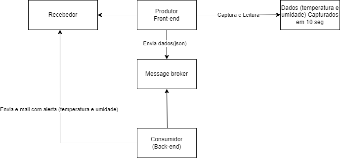
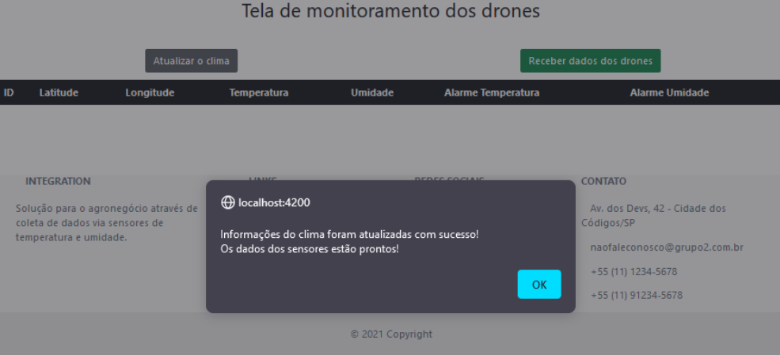
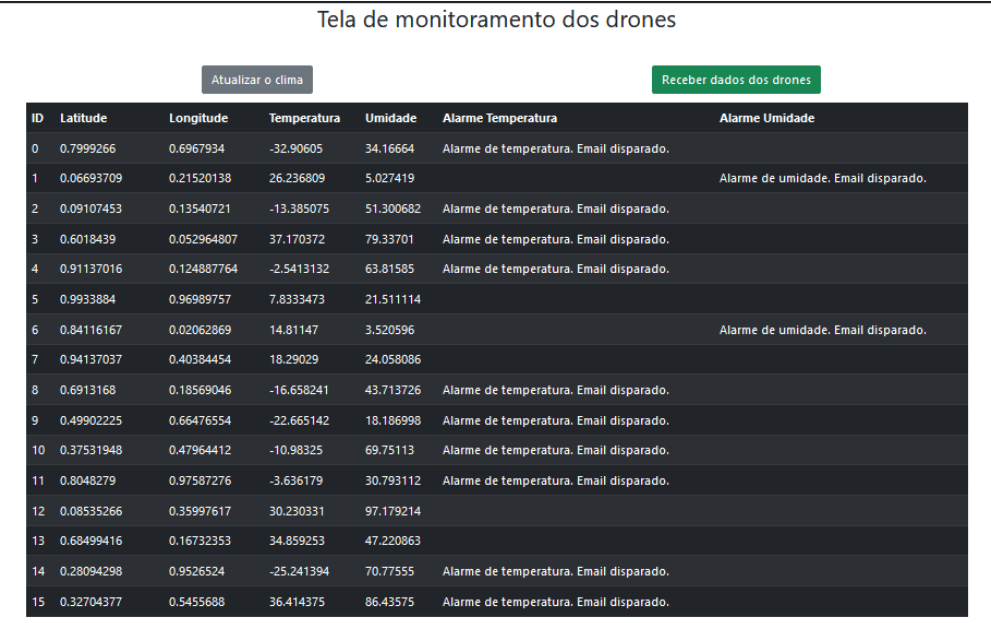
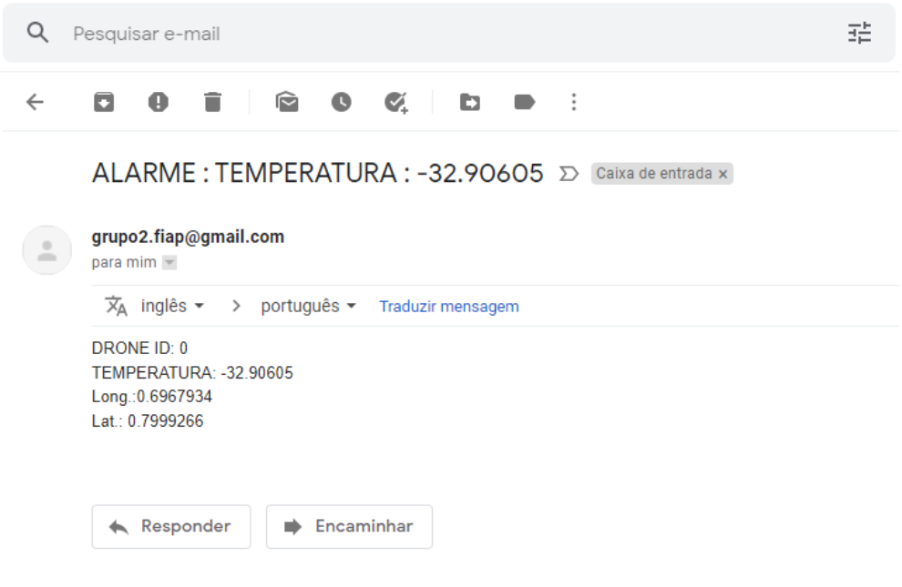

# Integration MQ

Esse é um projeto de um grupo que cursa o MBA em Desenvolvimento Full Stack na Fiap e tem como objetivo mostrar os conhecimentos obtidos nas aulas de Integrations & Development Tools. 

O objetivo desse projeto é apresentar um sistema que é uma poderosa ferramenta que auxilia agricultores à monitorar a temperatura e a umidade do ar para que possa manter seu cultivo com qualidade e eficiência. Através de um sistema interno ligado aos drones que sobrevoam o local, o agricultor receberá a cada x tempo uma coleta de dados sobre os estados de temperatura e umidade do ar, sendo imediatamente comunicado através de e-mail as anormalidades sobre temperaturas elevadas ou mesmo muito baixas, assim como sobre a unidade do ar. Tudo isso para auxiliar na tomada de decisões sobre como lidar com as discrepâncias e tomar as devidas providências.

### Topologia utilizada

### Configuração

Siga as instruções abaixo e experimente o prazer de poder tomar decisões com segurança e tempo.
Pré-requisitos para a subida do sistema.

- Após feito o clone git, abra de acordo com sua preferência uma das ides (Intellij ou Eclipse) e importe o projeto da pasta `integration-mq` e start o projeto através da classe IntegrationMqApplication.
- Abra o VSCode e aponte para a pasta `integration-front` e no terminal, rode os comandos `npm install`, para instalação do projeto.
Obs: Será feita a pergunta:
Would you like to share anonymous usage data about this project with the Angular Team at Google under Google’s Privacy Policy at https://policies.google.com/privacy? For more details and how to change this setting, see https://angular.io/analytics. (y/N)
Responda Yes.
- Em seguida rode o comando `npm run start` para startar o projeto. Abra o navegador de sua preferência com o endereço: http://localhost:4200

### Instruções de uso

- Para realizar o monitoramento com a aplicação aberta no navegador, clique no botão `Atualizar o clima` e será apresentado a mensagem de atualização do clima como abaixo.

- Clique em `Receber dados dos drones` para que a lista de informações lhe seja mostrada. Em caso de discrepância de temperatura ou unidade, um e-mail lhe será enviado. 
Obs: Para receber os e-mails, basta abrir a classe: `Constants` do pacote `Com.fiap.grp2.integrationmp.util` e alterar o valor da string `EMAIL_DESTINO` para o e-mail desejado. 

O remetente grupo2.fiap é o responsável pelo disparo dos e-mails de notificação e este é o formato do e-mail que será recebido: 

